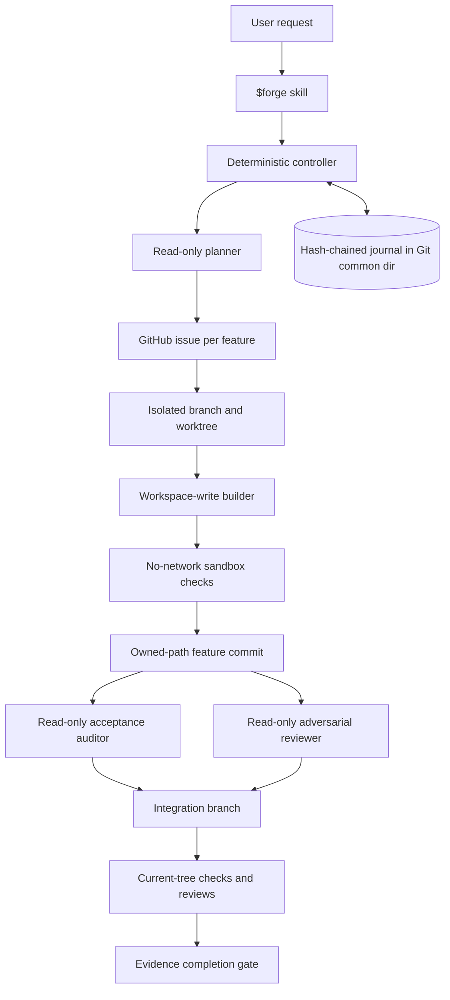

# Architecture

## Control flow

Codex workers reason, inspect, edit, and review. The TypeScript controller alone owns run state, GitHub mutations, Git staging and commits, task transitions, retries, evidence normalization, and the completion decision.

## State model

A run advances through `created → planning → issue_sync → executing → verifying → reviewing → integrating → complete`. Any active stage can become `blocked` or `failed`; a task is retried at most three times before the run becomes durably blocked.

Tasks advance through `pending → ready → running → verifying → committed → reviewed → complete`. Dependencies only become ready after every prerequisite is complete, and a child worktree is seeded with the actual prerequisite commits before its builder starts. Owned paths are case-insensitively non-overlapping, so two task writers cannot claim the same subtree.

Every journal event includes its resulting full state, monotonically increasing sequence, previous event hash, and its own SHA-256 hash. The append-only journal is authoritative; the snapshot is an optimization and is rebuilt whenever it differs, even at the same sequence. State lives under the resolved Git common directory, outside agent-writable worktrees. A PID/host-aware run lease fences two controllers from executing the same run, and dead same-host owners are recovered without stealing live or other-host leases.

## Agent roles

| Role | Sandbox | Session | Authority |
| --- | --- | --- | --- |
| Planner | read-only | ephemeral | Inspect and return a typed plan only |
| Builder | workspace-write | resumable by exact thread ID | Edit only the assigned worktree and owned paths |
| Acceptance auditor | read-only | ephemeral | Map every criterion to observable evidence |
| Adversarial reviewer | read-only | ephemeral | Try to disprove correctness, safety, compatibility, and test quality |

Leaf workers run with approval policy `never`; plugins, apps, browser/computer use, and nested multi-agent behavior are disabled. The controller invokes two reviewers concurrently and serializes their state writes through a bounded lock.

## Evidence gate

Evidence is valid only for the exact repository content hash and the exact plan/configuration hash. Completion requires every task issue, task commit, required command, acceptance criterion, and required distinct reviewer to have passing current-tree evidence. Critical/high findings must be fixed or rejected with evidence; medium findings require an explicit disposition.

The final integration branch replays every task retry commit in dependency order using immutable `Harness-Effect` trailers. It then reruns all checks and both reviewers on the combined tree so individually correct tasks cannot hide an integration regression. The gate rejects a dirty worktree or moved integration `HEAD`; an integrated failure reopens its responsible task, discards only the harness-owned integration worktree, and repeats within the retry budget.
